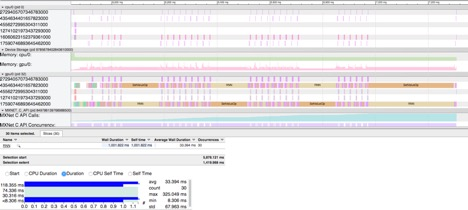

# Operator abnormal behavior

Below screenshot shows an abnormal amount of time taken by RNN operator in of the example. Observe that only few RNN op execution (once per every ~10 batch) takes abnormal amount of time.

